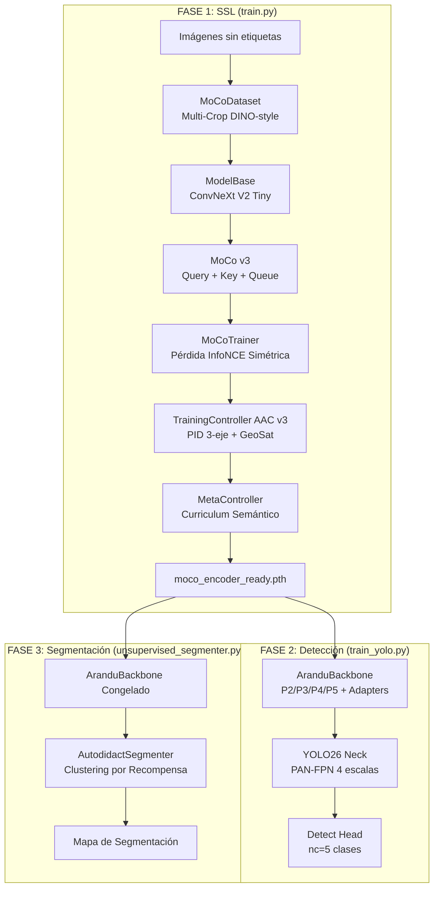
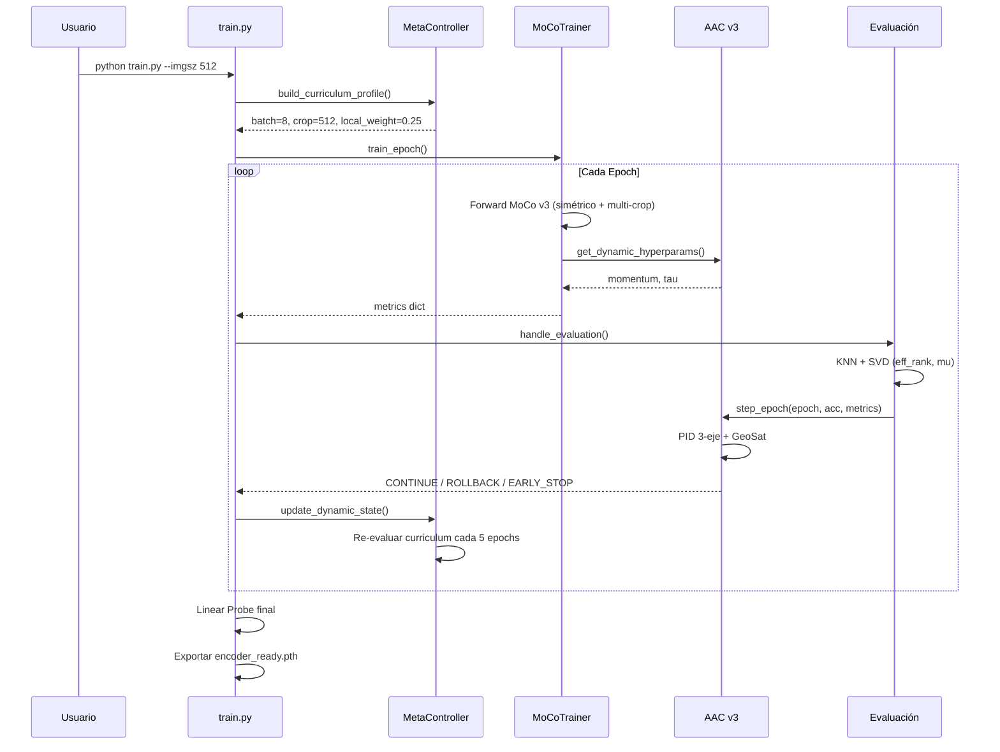
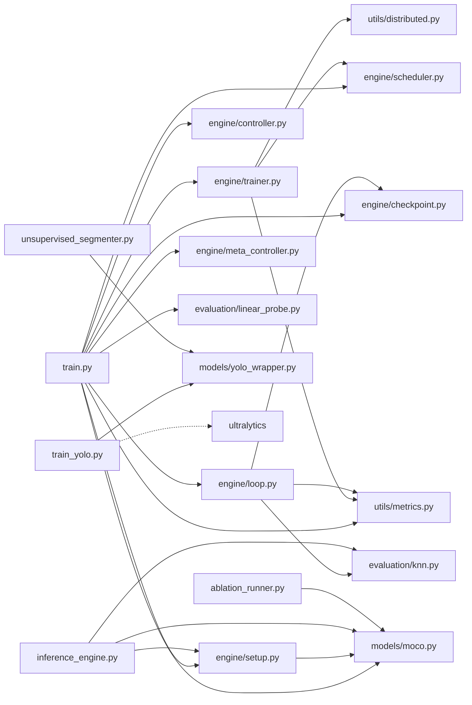

# 🌿 ARANDU-AI — Detector de Enfermedades en Soja (SSL + YOLO)

Pipeline de investigación de grado producción para la detección de enfermedades foliares en soja, combinando aprendizaje auto-supervisado (MoCo v3) con detección de objetos (YOLO26).

---

## Descripción

El sistema tiene dos etapas:

1. **AranduSSL** — Preentrenamiento auto-supervisado del backbone sobre imágenes de soja sin etiquetas, usando MoCo v3 con Multi-Crop DINO-style y un controlador adaptativo (AAC v3) que regula temperatura, momentum y LR en función del estado del espacio latente.

2. **ARANDU-YOLO** — Detector YOLO26 que reemplaza su backbone estándar por el encoder MoCo preentrenado, conectado al neck PAN-FPN mediante adaptadores espaciales con **Context Gate** aprendible por píxel.

---

## Estructura del Proyecto

```
ENCODER_YOLO/
├── config/moco.yaml            ← Hiperparámetros y paths (Kaggle)
├── engine/
│   ├── trainer.py              ← Loop MoCo (pérdida simétrica + Multi-Crop)
│   ├── controller.py           ← AAC v3: PID 3-eje + GeoSat (detector saturación)
│   ├── checkpoint.py           ← Guardado atómico / carga con weights_only=True
│   ├── setup.py                ← Construcción de dataloaders y modelos
│   ├── loop.py                 ← handle_evaluation / handle_rollback
│   └── scheduler.py            ← Cosine warmup + momentum_update
├── models/
│   ├── moco.py                 ← ModelBase (ResNet50+Projector+Predictor), MoCoQueue, MoCoDataset
│   └── yolo_wrapper.py         ← AranduBackbone (P3/P4/P5) + SpatialFeatureAdapter + Context Gate
├── evaluation/
│   ├── knn.py                  ← KNN con FAISS GPU (fallback CPU → sklearn)
│   └── linear_probe.py         ← Linear Probe con AMP sobre representaciones de 256-dim
├── utils/
│   ├── metrics.py              ← Alignment, Uniformity (logsumexp), Cosine Sims, Welford stats
│   ├── distributed.py          ← Helpers DDP (concat_all_gather, batch_shuffle)
│   ├── visualize_alpha.py      ← Heatmaps del Context Gate sobre imagen individual
│   ├── evaluate_alpha_dataset.py ← Evaluación cuantitativa de α (Cohen's d, Pearson)
│   └── corrupt_dataset.py      ← Generador de imágenes corruptas para stress-test
├── tests/test_scheduler.py     ← Tests del scheduler
├── ablation_runner.py          ← Orquestador del estudio de ablación (3 modelos)
├── arandu_yolo26.yaml          ← Arquitectura YOLO con AranduBackbone
└── train.py                    ← Entry point del pipeline SSL
```

# 🔬 Análisis Completo — ARANDU-AI ENCODER_YOLO

## 1. Visión General del Proyecto

Este es un pipeline de **detección de enfermedades foliares en soja** compuesto por dos grandes etapas:

1. **AranduSSL**: Preentrenamiento auto-supervisado (MoCo v3) de un backbone ConvNeXt V2 Tiny sobre imágenes sin etiquetas.
2. **ARANDU-YOLO**: Integración del encoder preentrenado como backbone de YOLO26, con un curriculum de 4 fases para fine-tuning progresivo.

---

## 2. Arquitectura del Sistema



---

## 3. Componentes — Análisis Detallado

### 3.1 Modelos (`models/`)

#### [moco.py](file:///home/ama-gi/Documentos/IAR/SojAI/code/ENCODER_YOLO/models/moco.py)

| Clase | Responsabilidad |
|-------|-----------------|
| `ModelBase` | Backbone ConvNeXt V2 Tiny (768-dim) + Projector MLP (768→2048→512) + Predictor MLP (512→1024→512). Soporta `use_predictor` y `return_norm`. |
| `MoCoQueue` | Cola FIFO circular de negativos (dim×K, K=16384-32768). Re-normaliza cada 500 pasos + broadcast DDP. |
| `MoCoDataset` | Dataset SSL con Multi-Crop: 2 vistas globales + 4 locales + 1 ultra-local. Counter thread-safe para errores de carga. |
| `get_global_transforms` | Augmentaciones globales domain-specific (hue≤0.02 para preservar señal diagnóstica de color). |
| `get_local_transforms` | Augmentaciones locales con kernel de blur dinámico proporcional al crop size. |

> [!IMPORTANT]
> El `ModelBase.forward` tiene el fix HIGH-4: siempre reporta `z_norm` (norma pre-normalización del projector), no `p_norm`, para detectar colapso correctamente.

#### [yolo_wrapper.py](file:///home/ama-gi/Documentos/IAR/SojAI/code/ENCODER_YOLO/models/yolo_wrapper.py)

| Clase | Responsabilidad |
|-------|-----------------|
| `AranduBackbone` | Backbone denso que extrae P2/P3/P4/P5 (96→192→384→768 ch) del ConvNeXt y aplica 4 `SpatialFeatureAdapter`. Curriculum de 4 fases de descongelado. |
| `SpatialFeatureAdapter` | Conv1×1 + DW-Conv3×3 + CoordinateAttention (opcional) + **Residual Gate** (`Y = X + β·T(X)`, β init=0). |
| `CoordinateAttention` | Atención espacial 1D (H + W) para micro-lesiones en P2/P3 de alta resolución. |

> [!NOTE]
> El Residual Gate cambió de "Context Gate" (α convexa) a un parámetro escalar β aditivo. β se inicializa en 0 → al inicio el adapter es un passthrough puro de las features SSL.

### 3.2 Motor de Entrenamiento (`engine/`)

#### [trainer.py](file:///home/ama-gi/Documentos/IAR/SojAI/code/ENCODER_YOLO/engine/trainer.py) — `MoCoTrainer`

- **Pérdida**: InfoNCE simétrica (2 vistas globales) + Multi-Crop local vectorizado (agrupado por resolución para máximo throughput GPU).
- **Métricas por step**: alignment, uniformity, pos/neg sim, std, norm, queue_std.
- **Fixes críticos aplicados**: CRIT-2 (reset de aliases por step para evitar contaminación NaN), R-5 (conteo correcto en ventanas de acumulación con batches NaN), BUG-ENQUEUE (enqueue solo en pasos de optimización).

#### [controller.py](file:///home/ama-gi/Documentos/IAR/SojAI/code/ENCODER_YOLO/engine/controller.py) — `TrainingController (AAC v3)`

El controlador más complejo del proyecto. Implementa un **PID continuo acoplado de 3 ejes**:

| Eje | Variable Controlada | Señal de Error | Rango de Actuación |
|-----|---------------------|----------------|-------------------|
| A — Termostato | Temperatura τ | Uniformity vs target -1.8 | [0.05, τ_max] |
| B — Freno | Momentum EMA α | Drift del centroide μ vs 5% | [α_min, 0.05] |
| C — Amortiguador | LR Scale | ΔRank efectivo vs 10% | [0.25, 1.0] |

**Subsistemas internos:**

- **GeoSat** (Detector de Saturación Geométrica): Evalúa drift, ΔRank, Δpos_sim, Δneg_sim usando un buffer FIFO de 3 evaluaciones.
- **Crisis Counter + Histéresis**: Anti-flapping con `crisis_threshold=2` y `healthy_streak≥2` antes de actuar.
- **Modo Supervivencia Estructural**: Si crisis_counter ≥ threshold+1, boost de τ y floor de lr_scale=0.4.
- **Acciones**: `CONTINUE`, `ROLLBACK` (restaura best checkpoint), `EARLY_STOP`.

> [!WARNING]
> El controlador tiene ~700 líneas y alta complejidad ciclomática. La lógica de decisión anida múltiples condiciones con umbrales empíricos que pueden ser difíciles de calibrar para nuevos dominios.

#### [meta_controller.py](file:///home/ama-gi/Documentos/IAR/SojAI/code/ENCODER_YOLO/engine/meta_controller.py) — `MetaController`

Controlador de **Nivel 2** que maneja el curriculum entre resoluciones (384→512→640px):

- Calcula un `health_score` compuesto (KNN×0.4 + align×0.2 + unif×0.2 + std×0.2).
- Re-evalúa cada 5 epochs si reducir/aumentar `local_loss_weight` y `num_local_crops`.
- Hereda métricas de la fase anterior vía `--prev_metrics`.

#### [checkpoint.py](file:///home/ama-gi/Documentos/IAR/SojAI/code/ENCODER_YOLO/engine/checkpoint.py)

- Guardado **atómico** (escribe `.tmp`, luego `os.replace()`).
- `adapt_keys()` resuelve combinaciones DDP + torch.compile.
- `load_checkpoint()` reconstruye el scheduler y hace fast-forward determinista.
- `load_weights_for_rollback()` carga solo pesos (sin tocar controller ni epoch).

#### [setup.py](file:///home/ama-gi/Documentos/IAR/SojAI/code/ENCODER_YOLO/engine/setup.py)

- Auto-descubrimiento de datasets en Kaggle (`resolve_kaggle_paths`).
- `build_eval_dataset()` detecta formato YOLO vs ImageFolder automáticamente.
- `YOLOClassificationDataset` extrae la clase del primer bbox de cada `.txt`.

#### [loop.py](file:///home/ama-gi/Documentos/IAR/SojAI/code/ENCODER_YOLO/engine/loop.py)

- `handle_evaluation()`: Extrae features → KNN → SVD (effective rank + centroide μ) → `controller.step_epoch()`.
- `handle_rollback()`: Restaura best checkpoint, reduce LR×0.5, resetea `lr_scale=1.0`.

#### [scheduler.py](file:///home/ama-gi/Documentos/IAR/SojAI/code/ENCODER_YOLO/engine/scheduler.py)

- Warmup lineal (1%→100%) + decaimiento cosenoidal con `final_lr_ratio` configurable.
- `momentum_update()` con unwrap de DDP y torch.compile.

### 3.3 Evaluación (`evaluation/`)

#### [knn.py](file:///home/ama-gi/Documentos/IAR/SojAI/code/ENCODER_YOLO/evaluation/knn.py)

- FAISS GPU con fallback automático a CPU y luego a sklearn.
- Recurso GPU singleton con cleanup via `atexit`.
- N2 FIX: `num_classes = max(y_train.max(), y_val.max()) + 1` para datasets desbalanceados.

#### [linear_probe.py](file:///home/ama-gi/Documentos/IAR/SojAI/code/ENCODER_YOLO/evaluation/linear_probe.py)

- LayerNorm + Linear sobre features congeladas del projector.
- Label smoothing=0.05 (calibrado para 5 clases).
- AMP completo incluyendo validation loop.

### 3.4 Utilidades (`utils/`)

#### [metrics.py](file:///home/ama-gi/Documentos/IAR/SojAI/code/ENCODER_YOLO/utils/metrics.py)

- `compute_uniformity()`: Wang & Isola con `logsumexp` para estabilidad numérica + subsample a 512 muestras.
- `get_module_stats()`: Estadísticas globales usando **algoritmo de Welford por lotes** (O(1) memoria extra).

#### [distributed.py](file:///home/ama-gi/Documentos/IAR/SojAI/code/ENCODER_YOLO/utils/distributed.py)

- `batch_shuffle_ddp` / `batch_unshuffle_ddp`: Shuffle inter-GPU para MoCo (evitar información "leak" entre key y query en la misma GPU).

### 3.5 YOLO Integration

#### [arandu_yolo26.yaml](file:///home/ama-gi/Documentos/IAR/SojAI/code/ENCODER_YOLO/arandu_yolo26.yaml)

Arquitectura YOLO de **4 escalas** (P2→P5):

- **Backbone**: `AranduYOLOWrapper` (layer 0) → genera [P2, P3, P4, P5].
- **Neck**: PAN-FPN completo con C2f en cada nivel. Top-Down (P5→P2) + Bottom-Up (P2→P5).
- **Head**: `Detect` sobre [P2_final, P3_final, P4_final, P5_final] con nc=5.

> [!TIP]
> La escala P2 (stride 4, 128ch) es inusual en YOLO estándar (que normalmente empieza en P3). Esto le da capacidad de detectar **micro-lesiones** que otros detectores ignorarían.

#### [train_yolo.py](file:///home/ama-gi/Documentos/IAR/SojAI/code/ENCODER_YOLO/train_yolo.py)

Curriculum de 4 fases:

| Fase | Épocas | Qué entrena | LR |
|------|--------|--------------|----|
| A | 10 | Solo adaptadores + head YOLO | base_lr × 1.0 |
| B | 15 | + Stage 3 (P5, 768ch) | base_lr × 0.5 |
| C | 15 | + Stage 2 (P4, 384ch) | base_lr × 0.8 |
| D | resto | Stem + Stages 2/3 (**Stages 0/1 CONGELADOS**) | base_lr × 0.3 |

> [!IMPORTANT]
> En Fase D, los Stages 0 y 1 del ConvNeXt permanecen **intencionalmente congelados** para evitar Catastrophic Forgetting de las features texturales de alta frecuencia aprendidas por MoCo (89% KNN accuracy).

### 3.6 Otros Scripts

| Script | Propósito |
|--------|-----------|
| [ablation_runner.py](file:///home/ama-gi/Documentos/IAR/SojAI/code/ENCODER_YOLO/ablation_runner.py) | Auditoría de Semantic Occupancy Ratio (SOR) y Capture Entropy por clase y tamaño de crop. Usa K-Means K=3 para prototipos de clase. |
| [inference_engine.py](file:///home/ama-gi/Documentos/IAR/SojAI/code/ENCODER_YOLO/inference_engine.py) | Pipeline de inferencia completo: Linear Head + KNN + lógica de fusión experta (🟢/🟡/🔴). |
| [unsupervised_segmenter.py](file:///home/ama-gi/Documentos/IAR/SojAI/code/ENCODER_YOLO/unsupervised_segmenter.py) | **Nuevo**: Segmentación no supervisada por reward (clustering de features MoCo). |
| `FPS-Ocean-Filter.py` | Pipeline de curación de dataset con Farthest Point Sampling sobre embeddings. |
| `Active-Ocean-Generator.py` | Generador activo de oceans sintéticos guiado por vecindarios latentes. |
| `Semantic-Ocean-Filter.py` | Filtrado semántico de oceans basado en similitud con prototipos. |

### 3.7 Configuración

[moco.yaml](file:///home/ama-gi/Documentos/IAR/SojAI/code/ENCODER_YOLO/config/moco.yaml) — Hiperparámetros clave:

| Parámetro | Valor | Nota |
|-----------|-------|------|
| `dim` | 512 | Dimensión del espacio latente |
| `queue` | 32768 | Cola doblada para 2×T4 |
| `batch_size` | 16 | 384px en T4 con AMP |
| `grad_accum_steps` | 8 | EffBatch = 256 |
| `lr_base` | 2e-5 | Muy conservador para refinamiento |
| `tau_max` | 0.15 | Techo del controlador PID |
| `momentum_max` | 0.9995 | Key encoder no puede volverse inmóvil |

---

## 4. Flujo de Datos Completo



---

## 5. Evaluación de Calidad del Código

### ✅ Fortalezas

1. **Documentación exhaustiva**: Cada módulo tiene docstrings detallados con invariantes, justificaciones de diseño, y referencias a papers.
2. **Trazabilidad de bugs**: Todos los fixes tienen tags únicos (CRIT-2, HIGH-4, BUG-C5, etc.) que permiten rastrear la razón de cada cambio.
3. **Robustez ante fallos**: Guards para datasets vacíos, NaN en batches, FAISS GPU fallback, checkpoints corruptos.
4. **Guardado atómico**: Los checkpoints nunca quedan en estado parcial.
5. **Portabilidad**: `weights_only=True` en todos los `torch.load()`, soporte CPU/GPU/DDP/compile.
6. **Métricas ricas**: Alignment, Uniformity, Cosine Sims, Effective Rank, GeoSat Score — observabilidad completa del espacio latente.

---

## 6. Mapa de Dependencias entre Módulos



---

## 7. Resumen Estadístico

| Métrica | Valor |
|---------|-------|
| **Archivos Python** | ~25 |
| **Líneas de código (aprox.)** | ~5,500 |
| **Módulos de engine** | 7 (trainer, controller, checkpoint, setup, loop, scheduler, meta_controller) |
| **Clases principales** | ModelBase, MoCoQueue, MoCoDataset, AranduBackbone, SpatialFeatureAdapter, TrainingController, MetaController, AranduInferenceEngine, AutodidactSegmenter |
| **Fixes documentados** | 40+ (CRIT, HIGH, BUG, FIX tags) |
| **Tests** | Mínimos (test_parse.py, test_ablation.py, tests/) |
| **Resoluciones soportadas** | 384px, 512px, 640px |
| **Clases de enfermedades** | 5 (healthy, mosaic, frog_eye, bacterial_blight, potassium_deficiency) |
